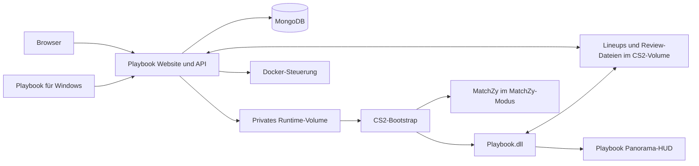

# Architektur von Playbook

Playbook besteht aus einer Webanwendung, einem eigenen Server-Plugin, einem Client-HUD und einer Windows-App. Docker Compose verbindet Dashboard, MongoDB und CS2. Die lokale Entwicklungsumgebung startet nur MongoDB, API und Frontend.

## Website und Daten

`admin-panel/client/` enthält die React-Website. Die API unter `admin-panel/src/` prüft Steam-Sitzungen, Rollen, Erstellerrechte und Revisionen. MongoDB hält Einstellungen, Benutzer, Lineups, Website-Favoriten und das Audit. Bilder liegen im Upload-Volume; Review-Medien verwenden UploadThing.

Die API schreibt Servereinstellungen und Berechtigungen in das private Runtime-Volume. Der CS2-Bootstrap liest diese Dateien bei jedem Start und installiert die gewählten Komponenten. Die Website steuert den CS2-Container über Docker und kommuniziert für Konsolenbefehle per RCON. Der Compose-Projektname wird an die API weitergegeben, damit sie zuerst innerhalb des eigenen Stacks nach CS2 sucht.

Lineup-Daten werden zwischen MongoDB und der gemeinsamen `savednades.json` synchronisiert. Aufnahmen, Metadaten und Review-Steuerung verwenden zusätzliche Dateien daneben. Die API erhält ihre erweiterten Metadaten beim Import. Das gemeinsame Basisformat bleibt mit MatchZy kompatibel.

## Eigenes Server-Plugin

`server-plugin/Playbook/` baut `Playbook.dll` mit dem Namespace `Playbook`. Das Image enthält die DLL unter `/opt/playbook/`; der Bootstrap installiert sie unter `addons/counterstrikesharp/plugins/Playbook/`.

Das Plugin prüft Rollen in allen Modi. Im Modus `nades` steuert es Training, Respawn, Granaten, Bots, Lineups und Reviews selbst. Das Panorama-HUD rendert auf dem CS2-Client. Sein Layout heißt `playbook_training.xml`; das Panel bleibt kompakt und reserviert neun Listenplätze. Spielereinstellungen und Ingame-Favoriten liegen unter `Playbook/data/players/`.

## MatchZy-Integration

Der Bootstrap installiert MatchZy ausschließlich im Modus `matchzy`. Dort besitzt MatchZy die Match- und Practice-Befehle. `MatchZyState` liest den Practice-Zustand des geladenen Plugins; Playbook stellt sein Panel und seine Lineup-Funktionen bereit. Außerhalb dieses Modus wird die MatchZy-DLL entfernt, die gemeinsame Bibliothek bleibt erhalten.

MatchZys Befehle, Cvars, Rollenflags, Versionsfeld und Dateiformat behalten ihre ursprünglichen Namen. Playbook verwendet dafür keine umbenannte Kopie des externen Plugins.

## Windows-App und HUD

`playbook-desktop/` verbindet die Playbook-Website mit lokalem CS2. Electron und das native Hilfsprogramm übernehmen Spielstart, Netconsole, Bildaufnahme und die Wiederherstellung lokaler Kameraeinstellungen. Desktop-Updates beziehen ihre Releases aus `realS3BI/playbook`.

`training-hud/` enthält das Layout und die Styles des Ingame-Panels. Valves Workshop Tools kompilieren sie auf Windows. Ein Server-Plugin-Build aktualisiert diese Client-Dateien nicht. Das vorhandene Workshop-Item bleibt bei der Umbenennung dasselbe.

## Zugriffsregeln

Website-Favoriten gehören zur Steam-ID und der Lineup-Identität aus Owner, Map und internem Namen. Ingame-Favoriten werden separat pro Spieler gespeichert. „Alle“ zeigt auch ungeprüfte Aufnahmen.

Nur Ersteller bearbeiten, löschen oder reichen ihre noch nicht offiziellen Aufnahmen ein. Plattform-Admins dürfen auf der Website alle Aufnahmen löschen und vergeben „Offiziell“ und „Must Know“. Kartenpositionen dürfen Ersteller und Plattform-Admins auch bei offiziellen Aufnahmen korrigieren. Wurfdaten und Freigaben bleiben dabei erhalten. Ersteller und Plattform-Admins können eine Review-Einreichung oder Freigabe zurücknehmen. Das Lineup bleibt unter „Alle“ erhalten.
