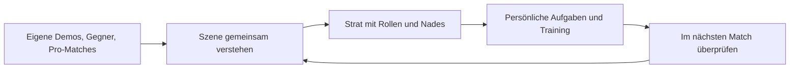
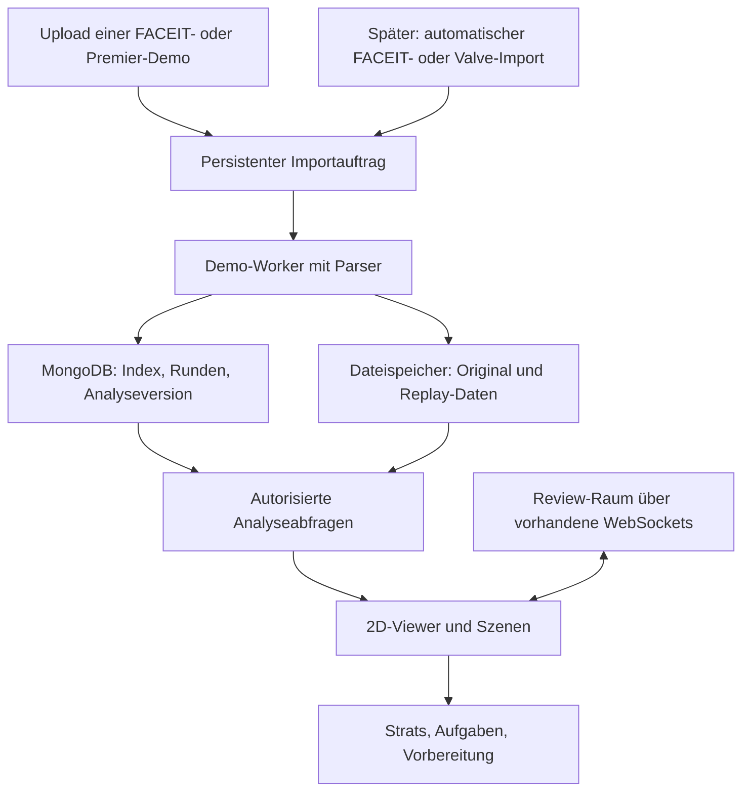

# Demoanalyse und Matchvorbereitung für Playbook

Stand: 5. Oktober 2026. Der erste Ausbau ist implementiert; Betriebsablauf und Grenzen stehen direkt unten. Sebastian hat eigene FACEIT- und Premier-/Matchmaking-Matches und das gemeinsame Ableiten von Strats und Training als Einstieg bestätigt. Der Captain bereitet den Review vor und führt das Team über die vorhandene WebSocket-Anbindung durch die Sitzung. Der nächste gewünschte Ausbau verbindet Prematch-Analyse, automatische Matchimports und den Modus **Live**. Live soll von Anfang an sowohl gespielte Matches als auch gemeinsame Demo- und Stratbook-Besprechungen aufnehmen. Die Sprachkommunikation läuft über Discord. Live, Prematch und Matchimporte sind inzwischen implementiert. Der geprüfte Betriebsablauf und die noch nötigen externen Zugänge stehen in [live-analysis-operations.md](live-analysis-operations.md). Der folgende Entwurf bleibt als Zielbild für weitergehende Automatisierung bestehen. Quellen und offene Datenzugänge stehen in [demo-analysis-research.md](demo-analysis-research.md).

## Implementierter erster Ausbau

Unter **Analyse** befinden sich Matches und Team-Reviews. Der Ablauf ist:

1. Die Demodatei aus FACEIT oder CS2 herunterladen und über **Demo hinzufügen** hochladen. Unterstützt werden `.dem`, `.dem.gz` und `.dem.bz2`, maximal 1 GiB Upload und 2 GiB entpackt. Der Dialog startet mit **Nur für mich**; eine Teamfreigabe erfolgt ausdrücklich beim Upload oder später.
2. Nach der Verarbeitung eine Runde öffnen. Die 2D-Ansicht zeigt Positionen, Blickrichtung, HP, Fokusspieler, Granatenbahnen und Ereignismarken. Zeitlupe, Zeitsprünge und Rundenwechsel funktionieren auch ohne gemeinsame Sitzung.
3. Als Owner oder Captain Anfang, Ende, Fokus und eine Frage auswählen und als Szene in einem Team-Review speichern. Szenen können bearbeitet, sortiert und entfernt werden.
4. Den Review-Link an die Teammitglieder weitergeben. **Sitzung starten** fixiert die vorbereitete Szenenfolge für diese Sitzung. Der Moderator steuert Play/Pause, Zeitpunkt, Tempo, Fokus, Szenenwechsel und einen Kartenzeiger. Andere Mitglieder folgen, können selbst nachsehen und wieder zum Captain zurückkehren. Anwesenheit und geladene Szenen werden angezeigt. Ein anderer Captain kann die Steuerung ausdrücklich übernehmen.
5. Erkenntnisse als Notizen zur Szene festhalten. **Strat daraus erstellen** erzeugt einen Entwurf mit dem Ausschnitt als Beispiel. Im Strat-Editor lassen sich vorbereitete Szenen auch bestehenden Strats und einzelnen Aufgaben zuordnen, jeweils mit einem Fokusspieler. Die vorhandenen Rollen, persönlichen Aufgaben, Nade-Verknüpfungen, Veröffentlichungen und Live-Strats bleiben der Trainingsablauf.

Der Player verwendet vorhandene kalibrierte Radarbilder. Smoke- und Feuerbereiche sind schematisch; Granatenbahnen stammen aus der Demo. Die Zeitbasis von 64 Ticks/s ist eine explizite Annahme des ersten Adapters. Nicht unterstützte Karten erhalten keine erfundene Projektion. Unvollständige Runden und Sonderfälle werden als Analysehinweise angezeigt. Der Kartenstand des vorhandenen Radarbilds kann vom historischen Match abweichen.

Jede Runde umfasst die Kaufphase (höchstens 30 Sekunden vor Freeze-Ende, damit Timeouts nicht die Zeitleiste füllen) und die Zeit nach Rundenende bis zur nächsten Runde (höchstens 10 Sekunden). Die Zeitbasis bleibt das Freeze-Ende; die Kaufphase hat negative Zeiten, deshalb behalten gespeicherte Szenen ihre Bedeutung. Der Player zeigt eine Rundenuhr wie im Spiel (Kaufphase, Rundenzeit, Bomben-Countdown, Rundenende), Phasenbänder auf der Zeitleiste, einen Killfeed, die Bombe auf dem Radar sowie pro Spieler aktive Waffe, Hauptwaffe, Granaten, Bombe, Kit, Rüstung und Geld. Inventar und Geld werden nur bei Änderungen gespeichert.

Der Buy-Typ pro Team und Runde wird automatisch erkannt: Pistol, wenn alle Spieler mit höchstens 1.000 $ starten; sonst entscheidet der durchschnittliche Ausrüstungswert nach dem Kauf (höchster Wert bis 20 Sekunden nach Freeze-Ende): ab 3.500 $ Fullbuy, ab 1.500 $ Semi-Buy, darunter Eco. Die Rundenleiste zeigt die Ausrüstungswerte beider Teams und lässt sich nach T- und CT-Buy filtern. Ältere Analysen enthalten diese Daten nicht; sie erscheinen erst nach einem neuen Upload.

Private Demos sind auch für fremde Plattform-Admins verborgen. Teamzugriff setzt eine aktuelle Mitgliedschaft voraus. Demo-Dateien liegen außerhalb des öffentlichen Upload-Verzeichnisses. Verknüpfte Demos können erst nach dem Entfernen ihrer Review-, Entwurfs-, veröffentlichten und aktiven Strat-Verweise gelöscht werden. Demo-Szenen erzeugen keine öffentlichen oder offiziellen Nades.

### Betrieb

`./dev.sh` beziehungsweise `node dev.mjs` startet jetzt auch `demo-worker`. Bei einer bereits laufenden Entwicklungsumgebung einmal neu starten. Produktion: `docker compose up -d --build`. Manuelle Demo-Uploads und Team-Reviews benötigen keine neuen Zugangsdaten. FACEIT-/Steam-Imports benötigen die separat dokumentierten Quellenzugänge. API und Worker teilen das Volume `demos` (Entwicklung) beziehungsweise `demo_data` (Deployment); MongoDB speichert Aufträge, Metadaten und Reviews. Diese Volumes gehören in die Datensicherung.

Der Worker verarbeitet einen Auftrag gleichzeitig. `@laihoe/demoparser2` ist auf Version `0.42.0` festgelegt. Jeder Parse-Vorgang läuft in einem eigenen Kindprozess, mit fünf Minuten Laufzeitlimit; der Worker-Container hat 4 GiB RAM, zwei CPUs und ein Prozesslimit. Uploads werden gestreamt. Identische Upload-Dateien werden innerhalb derselben privaten beziehungsweise Team-Sicht zusammengeführt. Ein anderer Kompressionscontainer ergibt einen anderen Datei-Hash.

Die API fragt abonnierte Verarbeitungsstände alle zwei Sekunden ab und sendet Änderungen über die vorhandene WebSocket-Verbindung. Wiedergabebefehle verwenden bestätigte Command-Nachrichten, eine Revisionsprüfung und einen serverseitigen Zeitanker. Dateidaten laufen über HTTP. Nach einem Reconnect wird die aktuelle Sitzung geladen; Befehle werden nicht blind erneut ausgeführt. Bei einem API-Neustart bleibt die Sitzung erhalten, Anwesenheit und Kartenzeiger werden neu aufgebaut.

Diese Umsetzung verwendet weiterhin eine API-Instanz. Das Validieren und Speichern von Szenenverweisen ist mit Löschungen und Teamänderungen innerhalb dieser Instanz serialisiert. Mehrere API-Replikate benötigen gemeinsame Ereignisse und eine verteilte Koordination dieser Schreibvorgänge.

Ein fehlgeschlagener Upload beziehungsweise Parse-Vorgang wird im Match angezeigt. Eine fehlgeschlagene Datei kann gelöscht und erneut hochgeladen werden. Es gibt noch keinen automatischen Ablauf oder eine Bereinigung fertiger Demos; sie bleiben bis zum Löschen gespeichert. Die Oberfläche lädt höchstens die 200 neuesten zugänglichen Matches beziehungsweise Reviews.

### Prüfung und noch offene Quellen

Die Linux-Testsuite wurde mit isoliertem MongoDB vollständig ausgeführt: 254 Tests, keine übersprungen. Darunter: echte zwei WebSocket-Clients, Reconnect, Kontrollrechte, Mitgliedschaftsentzug, private Demos, ausdrückliche Freigabe, gültige Szenenverweise, Dubletten und fehlerhafte Dateien. Eine echte Valve-Testdemo wurde vom gestreamten Upload bis zur Rundenabfrage geprüft. Dieselbe Demo wurde unkomprimiert sowie mit gzip und bzip2 im begrenzten Node-22-Alpine-Worker verarbeitet. Fixture und Herkunft sind im [Parser-Spike](demo-parser-spike.md) dokumentiert.

Typecheck und Produktionsbuild sind geprüft. Der Browser-Test deckt Review-Steuerung und den Übergang zum Strat-Editor ab. Eine aktuelle vollständige FACEIT-Demo, echte Overtime und weitere Spielversionen fehlen noch im Testkorpus; synthetische Rundengrenzen-Tests ersetzen diese Prüfung nicht.

**Noch nicht implementiert:** Import per FACEIT-Link oder Steam-Sharecode, automatische Matchhistorie, Gegner-/Turnierberichte, Veto-Vorschläge, Audioaufnahme und Audioimport, dauerhaft abspielbare Live-Aufzeichnungen, Pro-Match-Suche, KI-Zusammenfassungen, 3D- oder POV-Videowiedergabe. Externe Demos lassen sich bereits als lokale Dateien hochladen; deren Analyse ist noch kein automatisches Scouting. Die weiteren Abschnitte beschreiben den geplanten Ausbau.

## Nächster Ausbau: Live, Prematch und automatische Imports

### Ein Raum für Match und Besprechung

Der Einstieg **Live starten** bietet `Match begleiten` und `Demo / Stratbook besprechen`. Beide verwenden dieselbe Aufnahmeverwaltung. Der Captain wählt Team, optional Match oder Review, die präsentierte Strat und den Rechner für die Tonaufnahme. Alle Teilnehmer sehen, ob aufgenommen wird, welche Audioquellen aktiv sind und ob Uploads noch ausstehen. Eine Vorschau mit Pegeln und kurzer Hörprobe prüft die Quellen vor dem Start.

| Ablauf | Was gespeichert wird | Ergebnis |
| --- | --- | --- |
| Gespieltes Match | Zwei getrennte Spuren für Spiel und Kommunikation über ausgewählte Voicemeeter-Geräte, Zeitmarken und Aktionen im Playbook. Die eigene Stimme kann in die Kommunikationsspur gemischt werden. | Nach Import und Abgleich läuft die Demo mit den damaligen Calls. Der Captain markiert daraus Szenen und Trainingsaufgaben. |
| Gemeinsame Besprechung | Ton, Demo-Steuerung, Wechsel zwischen Demo und Stratbook, gezeigte Strat-Version, abgeschlossene Zeichnungen, Markierungen und Notizen. | Die Sitzung lässt sich mit den Erklärungen und den damals gezeigten Inhalten wiederholen. |
| Vorhandene Audiodatei | Private Audiodatei und bearbeitbare Zuordnung zur Demo oder zu einer vorhandenen Sitzung. | Extern aufgenommener Ton kann nachträglich hinzugefügt und ausgerichtet werden. Ohne gespeicherte Steueraktionen lässt sich daraus kein früherer Besprechungsablauf rekonstruieren. |

Die bestehende Funktion `Captain folgen` bleibt erhalten. Eigene Ansichtswechsel eines Teilnehmers verändern weder die gemeinsame Präsentation noch deren Aufzeichnung. Zur Sitzung gehört ein eigener präsentierter Strat-Stand. Das Anschauen einer alten Erklärung aktiviert keine alte Strat für das aktuelle Teamspiel. Eine echte Aktivierung bleibt eine bewusste Aktion mit den vorhandenen Rechten.

`Als Erklärung übernehmen` verknüpft einen Abschnitt der Aufzeichnung mit einer Strat oder einer Rollenaufgabe. Der Abschnitt kann deshalb Ton, eine Demo-Szene und den damals gezeigten Strat-Stand enthalten. Änderungen an der Strat dürfen die alte Erklärung nicht nachträglich verändern. Ein Zeitstempel im Transkript könnte später dieselbe Stelle öffnen; Transkription und KI sind keine Voraussetzung für die Aufnahme.

### Spiel und Kommunikation über die Windows-App aufnehmen

Ein bestimmter Aufnahme-Rechner erfasst zwei explizit gewählte Windows-Aufnahmegeräte. Im Voicemeeter-Setup ist B1 für CS2 und B2 für Discord plus eigenes Mikrofon vorgesehen. B3 bleibt der Mikrofoneingang für Anwendungen; A1/A2 bleiben Kopfhörer und Lautsprecher. Die vollständige Zuordnung und die verfügbare Mikrofonsteuerung sind in [live-analysis-operations.md](live-analysis-operations.md) dokumentiert. Empfangenes Ingame-Voice gehört bei gleicher CS2-Ausgabe zur Spielspur. Aus der Kommunikationsspur entstehen keine getrennten Sprecherkanäle.

Die ursprünglich erwogene Discord-Prozessaufnahme wird für dieses Setup durch WASAPI-Geräteaufnahme ersetzt. Damit entfällt die Anforderung an Windows-Build 20348 für Prozess-Loopback. Die App wechselt bei Geräteverlust nicht auf ein Standardgerät. Pegelanzeigen prüfen die gewählten Quellen. Discord-Mute und Push-to-Talk steuern den Mitschnitt nicht. Die optionale Voicemeeter-Steuerung verändert ausschließlich die B2-Zuleitung des gewählten Mikrofonkanals.

Der passive Helfer startet CS2 nicht und benötigt keine Verbindung zum Nade-Review. Ein tatsächlicher Windows-Test der Geräteaufnahme, längerer Synchronität und Voicemeeter-Steuerung bleibt erforderlich.

Die App schreibt Audio fortlaufend in lokale, begrenzte Segmente. Eine persistente Uploadliste hält Reihenfolge, Prüfsummen, tatsächliche Dauer und bestätigte Uploads fest. Nach Verbindungsabbruch oder Neustart werden fehlende Segmente nachgeladen. Volle Platte, verlorene Audioquelle und Aufnahmepausen erzeugen sichtbare Lücken. Erst nach erfolgreicher Speicherung und Prüfung darf eine lokale Aufnahme gemäß der gewählten Aufbewahrung entfernt werden.

### Zwei Zeitachsen statt eines einzigen Audio-Offsets

Bei einer Besprechung läuft die Aufzeichnung weiter, während die Demo pausiert oder zurückspringt. Deshalb ist die Sitzungszeit die maßgebliche Uhr. Ein dauerhaftes Ereignisprotokoll speichert Play/Pause, Sprünge, Tempo, Fokus, Szenenwechsel, Präsentationswechsel und Strat-Stand relativ dazu. Beispielsweise kann bei Sitzungsminute 12 dieselbe Demosekunde erklärt werden wie zuvor bei Minute 8. Eine einzelne Verschiebung der Audiospur kann das nicht abbilden.

Der bestehende [ReviewSession-Typ](../admin-panel/shared/demos.ts) enthält nur die laufende Szene und ihren Wiedergabezustand. Er wird um eine getrennte, dauerhaft gespeicherte Aufzeichnung ergänzt. Ereignisse erhalten Sitzungs-ID, eindeutige Befehls-ID, Sequenznummer und Sitzungszeit. Wiederholte Uploads oder erneut gesendete Befehle erzeugen keine doppelten Einträge. Regelmäßige Zustandsstände erlauben Sprünge innerhalb langer Aufzeichnungen. Aufnahme und Ereignisprotokoll müssen nach einem Reconnect ihre gemeinsame Zeitbasis wiederherstellen; Lücken bleiben erkennbar.

Audio verwendet Samplepositionen beziehungsweise eine monotone Aufnahmeuhr. Der Zeitpunkt, an dem ein Paket am Server eintrifft, ist kein verlässlicher Aufnahmezeitpunkt. Bei Browseraufnahmen ist auch die Zahl der `MediaRecorder`-Chunks keine Uhr, da ihre Intervalle variieren können. Die Fertigstellung prüft Container und Dauer; einzelne Chunks werden nicht ungeprüft als selbstständig abspielbare Dateien behandelt. [MDN: MediaRecorder-Zeitintervalle](https://developer.mozilla.org/en-US/docs/Web/API/MediaRecorder/dataavailable_event)

Für ein gespieltes Match verbindet eine gesonderte Zuordnung Audiozeit und Original-Demoticks. Mindestens zwei überprüfbare Anker helfen, Versatz und zeitliche Drift zu erkennen. Bei Pausen, Neustarts oder getrennten Aufnahmesegmenten entstehen mehrere Zuordnungsabschnitte. Die Oberfläche erlaubt den manuellen Abgleich, etwa anhand von Rundenbeginn und einem späteren Ereignis. Bei hochgeladenem Fremdaudio bleibt dieser Weg immer verfügbar.

Ein späterer lokaler Game-State-Integration-Adapter kann beim Match Zeitmarken für Runde und Phase liefern. Das ist ein Prüfansatz, keine belegte tickgenaue Synchronisierung: Die Valve-Dokumentation ist historisch und beschreibt bereits verzögerte Ereignisse. Aktuelle CS2-Daten, erlaubter Wettbewerbseinsatz und der Abgleich mit vollständigen Demos müssen praktisch geprüft werden. Die grundlegende Aufnahme funktioniert auch ohne diesen Adapter. [Valve: GSI-Einführung](https://blog.counter-strike.net/date/2015/page/2/), [Valve: verzögerter GSI-Pflanzzeitpunkt](https://blog.counter-strike.net/2015/12/13409/)

WebSockets transportieren weiterhin Steuerung, Zustände und kleine Ereignisse. Audiodaten laufen über wiederaufnehmbare HTTPS-Uploads. Das verhindert, dass ein großer Upload Wiedergabebefehle im selben Kanal aufhält. Für Unterbrechungen gibt es getrennte Zustände wie `Aufnahme läuft`, `Upload ausstehend`, `Wird fertiggestellt`, `Bereit` und `Unvollständig`.

### Prematch wird ein belegbarer Matchplan

Der Captain fügt FACEIT-Matchroom oder Team hinzu, ordnet den tatsächlichen Wettbewerb zu und bestätigt das erwartete Lineup. Die Vorbereitung zeigt Zeitraum, verfügbare Matches, Roster-Übereinstimmung und Demo-Abdeckung. Ein fester Fünfer, eine wechselnde FACEIT-Lobby und Einzelhistorien dürfen nicht als derselbe Gegnerdatensatz gelten.

Die erste Berichtsebene verwendet Matchmetadaten: gespielte Maps, Ergebnisse, Aktualität und Besetzung. Mit analysierten Demos kommen wiederholte Eröffnungen, frühe Utility, CT-Positionen und ausgewählte Beispielrunden hinzu. Jede Tendenz nennt Stichprobe und Filter und öffnet ihre Quellen. Der Captain verbindet Beobachtungen mit eigenen Strats und Nades und veröffentlicht daraus eine kurze Vorbereitung für das Team.

Kill-Ereignisse tragen inzwischen die Identitäten beider Beteiligten, Runden enthalten Buy-/Freeze-Phase und einen automatisch erkannten Buy-Typ. Für eine belastbare Trade-Analyse fehlen weiterhin Auswertungen über mehrere Runden. Neue Analyseversionen ersetzen bestehende Szenen nicht stillschweigend.

Pick-/Ban-Aussagen benötigen tatsächliche Veto-Daten. FACEIT dokumentiert ein `voting`-Feld, dessen Inhalt in der Spezifikation offen bleibt. Der Bericht zeigt eine Veto-Historie erst nach Prüfung dieser Daten. Team und Turnier allein reichen nicht, um eine Spielweise zu behaupten. Die [ergänzende Quellenprüfung](demo-analysis-research.md#ergänzende-prüfung-automatische-imports-und-gegnerberichte) beschreibt die verfügbaren Schnittstellen und ihre Grenzen.

### Automatische Imports mit getrenntem Matchindex

Ein neuer Matchindex speichert Quelle, externe Match-ID, Karteninstanz, Zeitpunkt, Besetzung, Ergebnis und Dateiverfügbarkeit. Ein Match bleibt damit sichtbar, auch wenn keine Demo beschafft werden kann oder deren Original bereits entfernt wurde. Eigene persönliche Importe sind zunächst privat; eine Teamverbindung bestimmt ausdrücklich, welche Matches ins Team gelangen.

Für FACEIT verwendet das Backend einen Betreiber-Key für Metadaten. Webhooks melden neue Matches und bereitstehende Demos, ein regelmäßiger Abgleich holt verpasste Einträge nach. Account-Linking und Zugang zur Downloads API sind getrennte Voraussetzungen. Ohne Downloads-Freigabe funktionieren Metadaten und manueller Dateiimport, aber kein versprochener vollautomatischer Demoabruf. [FACEIT-Webhooks](https://docs.faceit.com/docs/webhooks/), [Downloads API](https://docs.faceit.com/getting-started/Guides/download-api/)

Bei Steam bestätigt der vorhandene Login nur die Identität. Der History-Adapter benötigt zusätzlich Game Authentication Code, Ausgangs-Sharecode und Betreiber-Web-API-Key. Die anschließende Auflösung zur Demodatei braucht einen separat geprüften Game-Coordinator-Zugang. Ein möglicher lokaler Desktop-Resolver wird gegen einen gehosteten Resolver abgewogen; ein unbeaufsichtigter Serverimport ist noch nicht nachgewiesen. Zugangsdaten gehören in geschützte Einstellungen beziehungsweise Betreiberkonfiguration, nicht in Teamnotizen oder Browser-Logs. Details stehen in der [Valve-Recherche](demo-analysis-research.md#steampremier-identität-historie-und-downloadauflösung).

Der Import speichert dauerhafte Cursor, wiederholt begrenzte Fehlversuche und beachtet Quoten. Externe Match-ID und Karteninstanz verhindern mehrfache Verarbeitung, wenn mehrere Teamspieler dasselbe Match liefern. Eine gemeinsame Datei erweitert keine Zugriffsrechte. Downloads verwenden geprüfte Quellen, Größen- und Zeitlimits sowie begrenzte Weiterleitungen. Ein abgelaufener Link führt zu `Demo nicht mehr verfügbar`, nicht zum Verlust des Matcheintrags.

### Speicher begrenzen und Lernmaterial erhalten

Der Worker speichert Replay-Daten im lokalen Demo-Volume. Bei neuen Uploads und Importen entfernt er das Original nach erfolgreicher Analyse und Prüfung aller gespeicherten Runden. Bereits vorhandene Originale aus älteren Versionen bleiben erhalten; Demo-Auswertungen laufen nicht automatisch ab. UploadThing ist derzeit an Nade-Review-Bilder und -Videos gebunden. Neue Teamaufnahmen benötigen einen eigenen privaten Medienzugang.

Aufbewahrung für Demos und Aufzeichnungen:

| Inhalt | Aufbewahrung |
| --- | --- |
| Matchindex und Quellenverweise | Bis zur Löschung durch den Berechtigten oder zum Ende des verbundenen Arbeitsbereichs. |
| Originaldemo | Bei neuen Uploads und Importen nach erfolgreicher Verarbeitung und Prüfung der gespeicherten Rundendaten entfernen. |
| Replay-Daten | Bis zur ausdrücklichen Löschung behalten, einschließlich Granaten und Smoke-Ereignissen. |
| Live-Aufzeichnungen | 90 Tage nach Sitzungsende, sofern nicht angeheftet oder als Erklärung verwendet. |
| In Strats oder gespeicherten Erklärungen benötigte Daten | Durch die Verknüpfung vor automatischer Löschung schützen. Später können eigenständige Szenenpakete den benötigten Umfang verkleinern. |
| Lokale Arbeitsdateien und fehlgeschlagene Uploads | Nach Abschluss beziehungsweise einer begrenzten Wiederholungsfrist entfernen. Aktive Verarbeitung und noch nicht gesicherte Aufnahmen bleiben geschützt. |

Bereits verarbeitete Originale aus älteren Versionen werden nicht rückwirkend entfernt. Bei neuen Demos schützt auch eine verknüpfte Szene nicht die Originaldatei: Für Wiedergabe genügen die erhaltenen Replay-Daten, für eine spätere Neuberechnung wird das Original oder ein noch verfügbarer erneuter Download benötigt. Diese Unterscheidung steht beim Archivieren in der Oberfläche.

Vor Downloads reserviert der Worker Platz für Original, Entpacken und Ausgabedaten. Teamquote, Gesamtkontingent und freier lokaler Arbeitsraum werden getrennt geprüft. Bei voller Quote stoppt der Dateinachschub; der Matchindex kann weiter aktualisiert werden. Geschütztes Lernmaterial wird nicht automatisch verdrängt. Eine Speicheransicht zeigt tatsächliche Bytes, vorgemerkte Importe und das nächste Ablaufdatum. Konkrete Gesamtquoten werden an der Kapazität des Deployment-Servers festgelegt, nicht am freien Platz des Entwicklungsrechners.

Private Audioaufnahmen und archivierte Lernmedien können in UploadThing liegen, sofern die App private ACLs erlaubt. Kurzlebige signierte URLs werden erst nach aktueller Teamprüfung serverseitig ausgestellt. Öffentliche Nade-URLs dürfen nicht als Vorlage für Teamton dienen. Bereits ausgegebene Links bleiben bis zu ihrem Ablauf verwendbar, weshalb deren Laufzeit kurz sein muss. [UploadThing: private Dateien](https://docs.uploadthing.com/working-with-files)

UploadThing beseitigt den lokalen Arbeitsraum für Demoverarbeitung nicht. Auch `uploadFilesFromUrl` lädt laut SDK-Dokumentation zunächst auf dem eigenen Server herunter. Der geplante Import muss große Dateien deshalb begrenzt verarbeiten und den tatsächlichen Spitzenverbrauch messen. [UploadThing: UTApi](https://docs.uploadthing.com/api-reference/ut-api)

Eine Modellrechnung macht die Größenordnung sichtbar: 100 Demos zu angenommenen 500 MB belegen 50 GB. Spielton mit 128 kbit/s und Kommunikation mit 64 kbit/s benötigen zusammen rechnerisch rund 86 MB pro Stunde, also rund 8,6 GB für 100 Stunden. Das sind Rechenannahmen ohne Container-Overhead, keine gemessenen Matchdurchschnitte. Replay-Daten und Sicherungen kommen hinzu. Dauerhaftes Bildschirmvideo würde wesentlich mehr Speicher beanspruchen; für den ersten Live-Modus werden Ton und nachvollziehbare App-Aktionen gespeichert.

### Grenzen der Module und Umsetzungsschritte

| Modul | Verantwortet | Hält von anderen Modulen fern |
| --- | --- | --- |
| Matchquellen | Verbindungen, Matchindex, Cursor, Dateiverfügbarkeit und Importaufträge | Provider-Zugangsdaten, OAuth, Sharecode-/GC-Auflösung, Wiederholungen |
| Private Medien | Upload, Fertigstellung, autorisierten Abruf, Behalten und Bereinigung | Lokale Pfade, UploadThing-Schlüssel, signierte URLs und Quotenberechnung |
| Aufzeichnungen | Sitzung, Zeitbasis, Ereignisprotokoll, Tonspuren, Abgleich und reproduzierbare Wiedergabe | Geräte- und Codecdetails sowie Provider-Importlogik |
| Gegneranalyse | Nachvollziehbare Kennzahlen und Beobachtungen aus einem festgelegten Matchbestand | Native Parserfelder und ungesicherte KI-Aussagen |

Der bestehende Worker entfernt vor dem Parsen alle Dateien außer `source` aus seinem Demo-Verzeichnis. Audio darf deshalb nicht einfach dort abgelegt werden. Originale, versionierte Analyseergebnisse und Aufzeichnungen brauchen getrennte Lebenszyklen und Speicherbereiche. Demo-Löschungen müssen künftig auch Aufzeichnungen und Prematch-Verweise berücksichtigen. Ein Teammitgliedschaftsentzug gilt für HTTP, WebSockets und neu ausgestellte Medienlinks.

Die Umsetzung beginnt mit zwei technischen Nachweisen: Spiel und Kommunikation lassen sich in der Windows-App über längere Zeit aufnehmen, und je eine aktuelle FACEIT- sowie Premier-Demo lässt sich einem eigenen Match zuordnen. Parallel zum Aufnahmeversuch können Matchindex, Speicherverwaltung und die erste Prematch-Ansicht auf Metadatenbasis entstehen. Danach verbindet die gemeinsame Sitzungszeit Audio, Demo und Stratbook. Der erste veröffentlichte Live-Umfang enthält beide bestätigten Abläufe; automatische Synchronisierung darf bei unsicherer Zuordnung weiterhin einen manuellen Abgleich verlangen.

Vor Freigabe müssen folgende Abläufe funktionieren:

- Eine Besprechung pausiert die Demo, springt zurück und zeigt eine Strat. Die fertige Aufnahme gibt Ton und Ansichtswechsel in derselben Reihenfolge wieder, auch nach Neuladen und späterer Bearbeitung der Strat.
- Ein einstündiges Match wird mit zwei Tonspuren aufgenommen. Nach Demoimport stimmen überprüfte Anker am Anfang und Ende; Unterbrechungen und Drift werden erkannt oder korrigierbar angezeigt.
- Ein unterbrochener Upload und ein Desktop-Neustart verlieren keine bereits lokal gespeicherten Segmente. Fehlerhafte und doppelt gesendete Segmente werden zuverlässig behandelt.
- Voicemeeter-Mikrofonsteuerung, Gerätewechsel und fehlende Aufnahmegeräte werden auf einem echten unterstützten Windows-System geprüft. Versehentliche Aufnahme anderer Audioquellen ist ausgeschlossen oder vor Auswahl eindeutig beschrieben.
- Fünf verbundene Teamspieler erzeugen für dasselbe Match keinen fünffachen Import. Ein widerrufener Zugang oder nicht mehr verfügbarer Download hinterlässt einen verständlichen Matchstatus.
- Bei voller Quote läuft keine unbeschränkte Downloadschlange an. Ablaufbereinigung erhält alle für gespeicherte Erklärungen und Strats benötigten Daten und verändert vorhandene manuelle Uploads nicht.
- Ein Gegnerbericht trennt Besetzungen und fehlende Demos. Jede taktische Beobachtung führt zu ihren ausgewerteten Runden; Datenlücken erzeugen keine erfundenen Tendenzen.

## Ziel

Eine interessante Szene soll zu einer trainierbaren Aufgabe werden. Ein Team schaut beispielsweise einen Mirage-Execute an, markiert den entscheidenden Abschnitt, ordnet die fünf Spieler den eigenen Rollen zu und ergänzt passende Nades. Jeder Spieler findet danach seine Aufgabe, das Vorbild aus der Demo und das benötigte Lineup an derselben Stelle. Nach dem nächsten eigenen Match lässt sich prüfen, was davon funktioniert hat.

Das ist der Maßstab für den Ausbau. Zusätzliche Statistiken helfen dann, wenn sie zu einer belegbaren Beobachtung oder einer konkreten Trainingsentscheidung führen.

## Was das Projekt bereits mitbringt

Der untersuchte lokale Arbeitsstand enthält laufende, noch nicht vollständig eingecheckte Änderungen. Die folgenden Anknüpfungspunkte beschreiben diesen Arbeitsstand, keine Aussage über eine produktive Auslieferung.

| Vorhandener Baustein | Verwendung für die Demoanalyse |
| --- | --- |
| [Teams, Strats und Veröffentlichungsstände](../admin-panel/shared/strats.ts) | Szenen an eine Strat und einzelne Rollenschritte hängen. Die fünf Plätze und ihre Besetzung bleiben die gemeinsame Grundlage. |
| [Teamrechte](../admin-panel/shared/authorization.ts) | Private Analysen an die tatsächliche Teammitgliedschaft binden. Owner und Captains bearbeiten und veröffentlichen Strats. |
| [MongoDB für Teams und Strats](../admin-panel/src/workspace-store.ts) | Matchindex, Importaufträge, Szenen, Notizen und Vorbereitungen ergänzen. |
| [WebSocket-Server](../admin-panel/src/live-server.ts), [Live-Ressourcen](../admin-panel/src/live-resources.ts) und [Client](../admin-panel/client/src/lib/live.ts) | Bestehenden authentifizierten Transport, Ressourcenabonnements, Änderungsbenachrichtigungen und Wiederverbindung für den Review verwenden. |
| [Radarkalibrierung](../admin-panel/client/src/lib/nade-radar.ts) und [Ebenen](../admin-panel/client/src/lib/radar-layout.ts) | Weltpositionen auf die vorhandenen Karten projizieren. Projektion und Kartenstand pro Demo prüfen. |
| [Nade-IDs](../admin-panel/src/nade-ids.ts) und `StratStep.nadeIds` | Bestehende Lineups verknüpfen, statt eine zweite Nade-Bibliothek aufzubauen. |
| [Windows-App](../playbook-desktop/README.md) und Trainingsserver | Später konkrete Szenen in CS2 öffnen und Trainingsabläufe verbinden. Demowiedergabe ist dort noch nicht implementiert. |

Vor dem ersten Ausbau fehlten Demoimport, Parser und Demowiedergabe. Diese sind inzwischen wie oben beschrieben ergänzt. Die ursprüngliche [Radaransicht](../admin-panel/client/src/components/map-radar.tsx) zeichnet illustrative Kurven zwischen Start und Ziel. Das Replay verwendet dagegen die tatsächlich extrahierte Flugbahn; die illustrativen Kurven sind dafür kein Messwert.

## Bedienung

Die Sidebar bekommt einen Bereich `Analyse` mit Matches, Szenensammlungen und Matchvorbereitung. Teams, Strats und Maps behalten ihre Aufgaben. Team und Map bleiben beim Wechsel zwischen Analyse und Strat erhalten; teilbare Links enthalten die nötige Auswahl.

Der erste Einstieg ist `Demo hinzufügen`. Hochgeladene FACEIT- und Premier-Demos führen zur gleichen Matchansicht. Herkunft und tatsächliche Matchteilnehmer bleiben gespeichert. Automatische Importe folgen getrennt nach Quelle; eigene MatchZy-Serverdemos sind eine spätere Ergänzung. Importzustände lauten beispielsweise `Wird hochgeladen`, `Wird verarbeitet`, `Bereit` oder `Demo nicht verfügbar`. Ein vorhandener Matchdatensatz ohne Demo wird als solcher angezeigt.

Die Matchansicht zeigt eine große 2D-Karte, eine Rundenleiste und darunter die Zeitleiste mit Kills, Utility und Bombenereignissen. Spieler, Ausrüstung und Rundenkontext stehen unmittelbar daneben. Ein Klick auf ein Ereignis springt kurz davor, damit die Vorbereitung sichtbar bleibt. Zusätzliche Analysen öffnen sich bei Bedarf, statt dauerhaft die Karte zu verkleinern.

Ein markierter Abschnitt wird als Szene gespeichert. Diese enthält Anfang, Ende, Fokusspieler, eine kurze Beobachtung und die ursprüngliche Runde. Dieselbe Szene kann in einer Review-Sammlung, einem Gegnerbericht und einer Strat vorkommen. Ein geteiltes Teammitglied öffnet exakt denselben Ausschnitt, sofern es Zugriff auf die Quelle hat.

Für den gewählten Schwerpunkt gehört eine gemeinsame Review-Sitzung in den frühen Ausbau. Der Captain steuert Runde, Zeitpunkt und Wiedergabe. Teilnehmer können ihm folgen oder selbst nachsehen. Wiederbeitritt stellt den aktuellen Zustand her. Die aktuelle WebSocket-Anbindung hat die frühere regelmäßige Strat-Abfrage ersetzt. Für das Replay ergänzen wir einen gemeinsamen Wiedergabezustand; eine Übertragung kompletter Ansichten bei jedem Animationsbild ist nicht erforderlich.

Auf dem Handy stehen Vorbereitung, Aufgaben und kurze Szenen im Vordergrund. Detaillierte Vergleiche und das Bearbeiten von Abläufen bekommen Platz auf dem Desktop.

## Ein Review-Abend mit dem Team

1. Der Captain erstellt eine Review-Sammlung, beispielsweise `Mirage: Trades und A-Execute`. Er sortiert Szenen aus einem oder mehreren eigenen Matches und ergänzt je Szene eine kurze Frage oder Beobachtung. Vorbereitung und laufende Sitzung sind getrennt; Entwurfsänderungen verändern eine bereits gestartete Agenda nicht stillschweigend.
2. Die Teammitglieder öffnen den Review über einen Link. Der Raum zeigt Teilnehmer, Verbindungszustand und ob der aktuelle Abschnitt geladen ist. Die Demo wird unabhängig auf jedem Gerät wiedergegeben. Für das Gespräch ist im ersten Vorschlag ein vorhandener Sprachchat vorgesehen; eine eigene Sprachübertragung ist kein Bestandteil des Demo-Transports.
3. Der Captain startet die vorbereitete Reihenfolge, pausiert, springt zu Ereignissen und wechselt den Fokusspieler. Ein gemeinsamer Zeiger hilft beim Besprechen. Wer selbst zurückspringt, wechselt sichtbar zu `Selbst ansehen`; `Captain folgen` kehrt zum aktuellen gemeinsamen Zeitpunkt zurück.
4. Das Team hält eine Erkenntnis und eine nächste Aufgabe fest. Owner und Captains übernehmen geeignete Szenen in Strat-Entwürfe und verknüpfen Nades. Freie Review-Notizen verändern keine veröffentlichten Taktiken.
5. Nach der Sitzung bleiben Agenda, Szenen und beschlossene Aufgaben erhalten. Spieler können ihre Stellen später noch einmal öffnen. Beim nächsten Review lassen sich neue Ausführungen danebenstellen.

Die Ansicht reserviert den größten Bereich für die Karte. Die vorbereitete Szenenfolge steht daneben, Wiedergabe und Rundenleiste darunter. Teilnehmer und aktueller Moderator bleiben sichtbar. Notizen und persönliche Aufgaben öffnen sich im Kontext der Szene. Eine Sitzung hat genau einen steuernden Moderator, auch wenn mehrere Captains anwesend sind.

## FACEIT und Premier als Quellen

Der erste Import akzeptiert vollständige Demodateien aus beiden Quellen. Die Dateiverarbeitung berücksichtigt unterschiedliche Verpackungen; `.dem`, `.dem.gz` und `.dem.bz2` sind Zielvarianten, deren Erkennung, Größenbegrenzung nach Entpacken und Parserverträglichkeit im Technikversuch geprüft werden. Ein Match wird nicht durch Dateiname oder Spielernamen allein identifiziert. Wiederholte Uploads derselben Demo sollen innerhalb derselben Freigabe keine doppelten Matches erzeugen; andere Teams erhalten dadurch keine zusätzlichen Zugriffe.

Für FACEIT werden Matchroom-Link und Match-ID als Herkunft verwendet. Matchdaten und automatischer Dateidownload bleiben getrennt, da die Downloads-API einen eigenen Zugang verlangt. Ein manueller Upload bleibt verwendbar, solange eine automatische Quelle nicht verfügbar ist.

Für Premier unterscheiden wir Steam-Anmeldung, Match-Sharecode und eine Freigabe für den Matchverlauf. Die vorhandene Steam-Anmeldung bestätigt die Identität und ersetzt keine Freigabe der Matchhistorie. Ein Sharecode ist keine direkte Demodatei. Das spätere automatische Finden und Herunterladen weiterer Matches benötigt einen eigenen Adapter, dessen Zugang und Verhalten zuerst geprüft werden. Die [Valve-Recherche](demo-analysis-research.md) dokumentiert diesen Unterschied und die Grenzen der vorhandenen Quellen.

Spieler können dieselbe Partie mehrfach aus ihrer eigenen Historie liefern. Der Import ordnet Steam-IDs dem tatsächlichen Lineup zu; ein Match mit einzelnen Teammitgliedern wird nicht automatisch als Spiel der gesamten Fünferbesetzung eingeordnet. Das ist für spätere Auswertungen der gemeinsamen Entwicklung relevant.

## Gemeinsame Wiedergabe über die vorhandenen WebSockets

Der aktuelle Server akzeptiert Ressourcenabonnements und liefert Snapshots sowie Fehler. Im Client bestehen eine zentrale Verbindung, Wiederverbindung und eine Behandlung abgelaufener Sitzungen. Das neue Review-Modul verwendet diesen Transport; ein zweiter WebSocket-Server ist nicht vorgesehen.

Der Server hält den verbindlichen Sitzungsstand mit Team, Demo, Analyseversion, Runde, Ausgangszeitpunkt, Wiedergabegeschwindigkeit, Startzeit auf der Serveruhr, Zustand `spielt` oder `pausiert`, Moderator und fortlaufender Revision. Die Clients berechnen zwischen Änderungen den aktuellen Zeitpunkt selbst. Ein Abgleich mit der Serveruhr und kontrollierte Korrekturen behandeln Latenz und Abweichungen. Demos und größere Rundendaten werden autorisiert über HTTP geladen und lokal wiedergegeben.

Für Play, Pause, Sprung, Szenenwechsel und Steuerungsübergabe erweitern wir den bestehenden Transport um klar begrenzte Review-Befehle mit Anfrage-ID und erwarteter Revision. Der Server prüft Sitzung, Teammitgliedschaft und Steuerungsrecht bei jedem Befehl, bestätigt die Änderung und verteilt den neuen Stand. Ein veralteter Befehl oder eine doppelte Anfrage darf keine neuere Steuerung überschreiben. Unbestätigte Befehle werden nach einer Wiederverbindung nicht unbemerkt erneut ausgeführt.

Nach Verbindungsverlust abonniert der Client den Raum erneut und übernimmt den vollständigen aktuellen Stand. Veraltete Revisionen und verspätete Ladeergebnisse anderer Runden werden verworfen. Noch ladende Teilnehmer zeigen ihren Zustand; sobald sie bereit sind, springen sie zum aktuellen gemeinsamen Zeitpunkt. Ein lokaler Sprung im Modus `Selbst ansehen` verändert den Raum nicht.

Review-Sammlungen, Notizen und der letzte verbindliche Wiedergabezustand sind dauerhaft gespeichert. Anwesenheit und Zeigerbewegungen sind kurzlebig. Zeigerereignisse werden gebündelt und begrenzt; ein späterer Zeichenmodus speichert abgeschlossene Anmerkungen. Verliert der Moderator die Verbindung, bleibt seine Identität erkennbar; ein berechtigter Captain oder Owner kann die Steuerung ausdrücklich übernehmen. Bei einer Rückkehr erhält der frühere Moderator keine automatische Vorrangstellung.

Neue Raumressourcen prüfen Teamrechte sowohl bei HTTP-Abfragen als auch bei WebSocket-Abonnements. Die bisherigen Team-Prüfungen werden um Review-Aktionen im zentralen Rechtemodell ergänzt. Bereits entfernte Mitglieder erhalten keine weiteren privaten Inhalte. Ein geteilter Raumlink ist keine zusätzliche Freigabe.

Die vorhandenen Änderungsbenachrichtigungen sind pro API-Prozess gespeichert. Das passt zum aktuellen Compose-Aufbau mit einer API-Instanz. Mehrere API-Instanzen benötigen vor einer Skalierung eine gemeinsame Verteilung von Raumänderungen. Ein separater Parser-Worker muss fertiggestellte Jobs ebenfalls zuverlässig an die API melden; dessen Prozess teilt den aktuellen In-Memory-Verteiler nicht.

Die Prüfung verwendet zwei echte Browser-Sitzungen und umfasst Play/Pause, Sprünge, Geschwindigkeit, Nachbeitritt, Wiederverbindung, langsames Laden, konkurrierende Steuerungsversuche und entzogenes Teamrecht. Die erlaubte zeitliche Abweichung wird anhand der gewählten Replay-Abtastrate festgelegt und unter simulierter Latenz gemessen.

## Eigene Matches und Pro-Vorbilder

Beim eigenen Match markieren wir anfangs interessante Situationen manuell. Nützliche Fragen sind beispielsweise, warum eine Überzahl verloren ging, ob der Entry Unterstützung hatte oder welche Utility beim Execute fehlte. Später lassen sich Kandidaten anhand transparenter Regeln vorsortieren. Ein schlechter Rundenausgang beweist allein noch keinen individuellen Fehler.

Bei Pro-Matches speichert der Captain eine Szene als Vorlage für einen Strat-Entwurf. Er ordnet Demo-Spieler den vorhandenen fünf Plätzen zu und beschreibt die Aufgabe in eigenen Worten. Eine Vorlage kann mehrere Beispielrunden enthalten. Die eigene veröffentlichte Strat bleibt eine bewusste Teamentscheidung und verändert sich nicht, wenn später weitere Quellen hinzukommen.

Ein beobachteter Granatenwurf enthält je nach Datenlage Werfer, Zeitpunkt, Flugbahn und Wirkung. Daraus entsteht zunächst eine private Referenz in der Szene. Ein reproduzierbares Lineup verlangt zusätzlich eine Prüfung im Spiel. Abwurfposition und Ziel allein belegen weder exakte Eingaben noch ein funktionierendes Jumpthrow- oder Laufwurf-Setup. Die erste Version verknüpft deshalb vorhandene Lineups manuell.

Die allgemeine Nade-Bibliothek zeigt nach den Projektregeln unter `Alle` alle Aufnahmen. Deshalb werden Granaten aus privaten Teamdemos dort nicht automatisch angelegt. Eine spätere bewusste Übernahme muss diesen Sichtbarkeitswechsel erklären und die bestehenden Ersteller- und Freigaberechte beachten. `Offiziell` und `Must Know` bleiben Entscheidungen von Plattform-Admins. Demoanalyse ändert keine bestehenden Wurfdaten, Favoritenidentitäten oder Regeln für `radarFrom` und `radarTo`.

## Prematch-Analyse

Der Captain hinterlegt einen Gegner über FACEIT-Team, Matchroom oder eine Auswahl konkreter Spieler. Dazu kommen Turnier beziehungsweise Wettbewerb, Saison, Zeitraum, erwartetes Lineup und Matchformat. Ein Turniername allein ist keine eindeutige Datenquelle. Andere Veranstalter brauchen eine eigene Zuordnung oder manuell hinzugefügte Matches.

Die Vorbereitung zeigt zuerst ihre Datengrundlage: gefundene Matches, vorhandene Demos, erfolgreich analysierte Maps, Zeitraum und Besetzung. Ergebnisse trennen dieselbe Fünferbesetzung, teilweise übereinstimmende Lineups und individuelle Pug-Matches. Der Name eines FACEIT-Matchteams reicht nicht als Identität eines dauerhaften Teams.

Ein Bericht kann folgende Fragen beantworten, soweit Daten dafür vorliegen:

- Welche Maps spielt das Team, mit welchen Ergebnissen? Pick- und Ban-Aussagen setzen tatsächliche Veto-Daten voraus.
- Wo starten CT-Spieler und die AWP häufig? Welche frühe Utility wiederholt sich?
- Welche T-Eröffnungen, Zielsites und Execute-Zeitfenster kommen bei vergleichbaren Einkäufen vor?
- Wie verändert sich das Verhalten nach einem frühen Kill oder Verlust?
- Welche eigenen Strats passen zu diesen Beobachtungen, und welche Beispielrunden sollte das Team vorher ansehen?

Eine Aussage könnte im Entwurf so aussehen: `In 8 von 12 analysierten CT-Full-Buy-Runden dieser Besetzung liegt in den ersten 20 Sekunden eine Banana-Molotov. Quellen ansehen.` Diese Zahlen sind ein fiktives Darstellungsbeispiel. Die Oberfläche zeigt Häufigkeit, Stichprobe und Zeitraum zusammen. Fehlende Demos gelten nicht als Runden ohne das beobachtete Verhalten.

Jede Tendenz öffnet ihre konkreten Szenen. Eine taktische Antwort wird als Vorschlag gekennzeichnet, vom Captain geprüft und mit einer eigenen Strat verbunden. Die kurze Teamansicht enthält daraus einen Matchplan; tiefergehende Daten bleiben erreichbar.

FACEIT stellt Metadaten und Demodownloads über getrennte Zugänge bereit. Die Downloads-API verlangt einen eigenen Antrag und ein Token mit passendem Scope. Eine `demo_url` aus der Data API garantiert keinen direkten Dateizugriff. Die Freischaltung und die Verfügbarkeit repräsentativer Gegnerdemos müssen früh geprüft werden. [Offizielle FACEIT-Dokumentation](https://docs.faceit.com/getting-started/Guides/download-api/).

CS2.CAM dokumentiert bereits einen ähnlichen Zusammenhang aus Demos und [privatem Playbook](https://cs2.cam/en/wiki/private-playbook). Dessen [Vetoanalyse](https://cs2.cam/en/wiki/veto-analysis) ist laut Dokumentation in geschlossener Beta und verwendet HLTV-Historie; Amateurteams ohne diese Historie sind dort nicht abgedeckt. Das beweist keine generelle Funktionslücke des Produkts für FACEIT. Es zeigt, warum wir unseren konkreten Team- und Turnierfall selbst prüfen müssen.

## Technischer Aufbau

Weboberfläche und Express-Anwendung bleiben der Einstieg. Ein separates Demo-Modul übernimmt Import, Verarbeitung und das Bereitstellen von Runden und Szenen. Sein Interface hält Parserformat, Downloadlogik und große Dateien aus den Strat- und Teammodulen heraus. Ein Review-Modul verbindet die Szenen mit vorbereiteten Sammlungen und einer gemeinsamen Sitzung. Der Datei-Upload steht zuerst; Adapter für FACEIT und Valve kommen mit der jeweiligen tatsächlichen Anbindung hinzu. Mehrere parallel produktive Parser sind für den Start nicht nötig.

Der erste Worker verwendet inzwischen `@laihoe/demoparser2@0.42.0`; `demoinfocs-golang` bleibt eine Alternative für ereignisorientierte Verarbeitung. Parserwahl und erste Ressourcenmessungen stehen im [Parser-Spike](demo-parser-spike.md). Die Abdeckung weiterer Demoquellen wird mit zusätzlichen echten Demos geprüft. Die [Recherche](demo-analysis-research.md) dokumentiert die Projekte und Quellen. Ein neuer eigener Demoparser ist nicht vorgesehen.

MongoDB speichert Metadaten und einen kleinen persistenten Jobbestand mit atomarer Übernahme, Ablaufzeit, Wiederaufnahme und begrenzten Versuchen. Eine zusätzliche Queue-Infrastruktur ist erst bei entsprechendem Durchsatz nötig. Der Parser läuft in einem separaten Container mit begrenzter CPU, Laufzeit und Arbeitsspeicher, damit er den CS2-Server nicht ausbremst. Er bekommt keinen Docker-Socket und keine Serversteuerung.

Originaldemos und größere Positionsdaten liegen in einem Dateivolume, bei wachsendem Betrieb in einem passenden Objektspeicher. Der Browser lädt Runden und Zeitabschnitte nach. Präzise Ereigniszeitpunkte bleiben erhalten; die Abtastrate für die Visualisierung wird nach gemessener Qualität und Dateigröße gewählt. Positionsdaten werden nicht als ein riesiges Matchdokument in MongoDB abgelegt. UploadThing bleibt für die vorhandenen Review-Medien bestehen; ob es für große Demodateien passt, ist gesondert zu prüfen.

Ein nachvollziehbarer Datenstand umfasst:

- Quelle, externe Match-ID, Karteninstanz einer Serie, ursprüngliche Datei und Inhalts-Hash.
- Parser-, Analyseschema- und Kartenstand sowie Zeitpunkt und Status der Verarbeitung.
- Stabile Spieleridentitäten, tatsächliches Runden-Lineup, Seite und nachvollziehbare Rundenzuordnung einschließlich Verlängerung und Neustarts.
- Szenenreferenzen mit Demo-Identität, Analyseversion, Original-Ticks und Zeitangaben. Neuverarbeitung ersetzt keine bestehenden Verweise stillschweigend.
- Beobachtungen mit Filterdefinition, berücksichtigten Runden und Quellen. Fehlende Daten bleiben unterscheidbar von negativen Ergebnissen.

Demo- und Teamrechte werden bei jeder Abfrage und beim Ausliefern von Dateien geprüft. Persönliche Uploads sind zunächst privat; eine Teamfreigabe erfolgt ausdrücklich. Ein Strat-Verweis erweitert nicht automatisch den Zugriff auf eine Demo. Geteilte Sammlungen müssen auf zugängliche Quellen zeigen. Plattform-Admins erhalten nach dem bisherigen Modell keinen automatischen Zugriff auf fremde private Teamdaten.

Neue Rechte für Uploads, Notizen, Sammlungen und gemeinsame Reviews werden vor ihrer Implementierung im zentralen Rollenkatalog festgelegt. Strat-Entwürfe, Veröffentlichung und aktive Fassung verwenden weiterhin die vorhandenen Regeln. Serveraktionen setzen weiterhin die passenden Serverrechte voraus. Das Ingame-Panel bleibt kompakt mit neun Listenplätzen.

## Reihenfolge und überprüfbare Ergebnisse

| Schritt | Ergebnis, an dem wir den Ausbau beurteilen |
| --- | --- |
| 0. Datenzugang und Parser prüfen | Zuerst repräsentative eigene Demos beschaffen. Runden, Seitenwechsel, Spieler, Kills, Utility und Koordinaten gegen die Wiedergabe prüfen. Parsezeit, Spitzen-RAM und Ergebnisgröße messen. FACEIT-Zugang separat klären; Pro-Demos blockieren den ersten Ausbau nicht. |
| 1. Eine Demo vollständig nutzbar machen | Datei hochladen, Verarbeitung sehen, Runde im 2D-Viewer abspielen, Ereignis anspringen, Szene speichern und nach Neuladen exakt wiederfinden. Unvollständige Dateien und unbekannte Kartenstände verständlich behandeln. |
| 2. Gemeinsam auswerten und ins Teamlernen übernehmen | Captain bereitet eine Szenenfolge mit Notizen vor. Teammitglieder treten dem Review-Raum bei und folgen der gemeinsamen Wiedergabe über die bestehende WebSocket-Verbindung. Captain erstellt aus einer Szene einen Strat-Entwurf, weist fünf Rollen zu, ergänzt bestehende Nades und veröffentlicht. Mitglieder sehen ihre Aufgabe und das zugängliche Vorbild. |
| 3. Wiederholte Abläufe erleichtern | FACEIT-Metadaten und bei vorhandenem Zugang Dateien importieren. Premier-Verknüpfung über Sharecode beziehungsweise freigegebene Matchhistorie nach Prüfung des Valve-Zugangs ergänzen. Gezielte Rundenfilter und einen gemeinsamen Zeichenmodus ausbauen. Eigene Serverdemos sind eine weitere Quelle bei tatsächlichem Bedarf. |
| 4. Einen echten Gegner vorbereiten | Team und konkreten Wettbewerb zuordnen, Datenabdeckung zeigen und wenige überprüfte Tendenzen mit Szenen belegen. Daraus einen manuellen Matchplan mit eigenen Strats erstellen. |
| 5. Lernen und Muster vertiefen | Pro-Vorbilder kuratieren, Eröffnungen vergleichen, Trainingsergebnisse festhalten und geplante Abläufe mit eigenen Matches vergleichen. Mustererkennung schrittweise gegen manuell bewertete Runden prüfen. |
| 6. KI ergänzen | Fragen in geprüfte Filter übersetzen, belegte Erkenntnisse zusammenfassen und bearbeitbare Strat- oder Trainingsvorschläge erzeugen. Jede sachliche Aussage führt zurück zu Runden und Szenen. |

Der FACEIT-Zugang wird bereits in Schritt 0 geprüft, obwohl die umfangreiche Gegneroberfläche später kommt. Der erste Viewer verarbeitet auch manuell hochgeladene Gegner- und Pro-Demos. Die Quellen teilen sich dieselbe Grundlage.

Der erste nutzbare Umfang endet bei `Demo → Szene → eigene Strat → persönliche Aufgabe mit Nade`. Eine vollständige 3D-Darstellung, automatische Videoproduktion und umfassende Veto-Prognosen sind weitere Ausbauten. Für sie entscheiden wir nach dem ersten praktischen Review, ob sie die Arbeit tatsächlich erleichtern.

## KI und weitere Lernfunktionen

Für Fragen wie `Zeig mir alle schnellen B-Runden des Gegners auf Inferno` übersetzt KI die Formulierung in prüfbare Filter. Die eigentlichen Häufigkeiten berechnet das Analysemodul. Die Antwort nennt Zeitfenster, Besetzung, Stichprobe und die gefundenen Szenen. Bei zu wenig Material sagt sie das ausdrücklich. Eine KI-Zusammenfassung kann fehlende Demodaten nicht ersetzen.

Weitere nützliche Ausbauten sind ein kurzer Matchplan vor dem Spiel, persönliche Lernlisten, manuell bestätigte Trainingsstände und Vergleiche zwischen Vorbild und eigener Ausführung. `Angesehen`, `im Training geschafft` und `im Match umgesetzt` sind unterschiedliche Zustände. Für jede Auswertung sollten wir entscheiden, was automatisch belegbar ist und was ein Spieler oder Captain bestätigen muss.

Ob für ein Training eine andere Smoke, ein zusätzlicher Trade-Spieler oder ein einfacherer Ablauf hilft, wird zunächst gemeinsam bewertet. Diese Entscheidungen liefern später bessere Beispiele für KI-Vorschläge als eine Sammlung unbelegter automatischer Bewertungen.

## Festgelegter Einstieg

Sebastian hat eigene FACEIT- und Premier-Matches und das gemeinsame Ableiten von Strats und Training als ersten Schwerpunkt bestätigt. Der Captain bereitet den Review vor; das Team trifft sich in einer Sitzung mit gemeinsamer Wiedergabe über die vorhandenen WebSockets. Der erste Ausbau umfasst deshalb Schritt 0 bis 2 mit einer echten Teamdemo als durchgehendem Beispiel. Eine automatische Klassifikation sämtlicher Fehler ist keine Voraussetzung für diesen ersten Review-Abend.

Der erste Ausbau ist mit der dokumentierten Valve-Testdemo und zwei verbundenen Browser-Sitzungen geprüft. Aktuelle vollständige FACEIT- und Premier-Demos bleiben für den Quellenvergleich nötig. Live-Aufzeichnungen, Prematch und automatische Imports sind als Erweiterung umgesetzt; die externe Anbindung und reale Voicemeeter-Aufnahme benötigen die in [live-analysis-operations.md](live-analysis-operations.md) beschriebenen Betriebsschritte. Ein echter Prematch-Pilot benötigt außerdem ein konkretes FACEIT-Team und den tatsächlich gespielten Wettbewerb.
