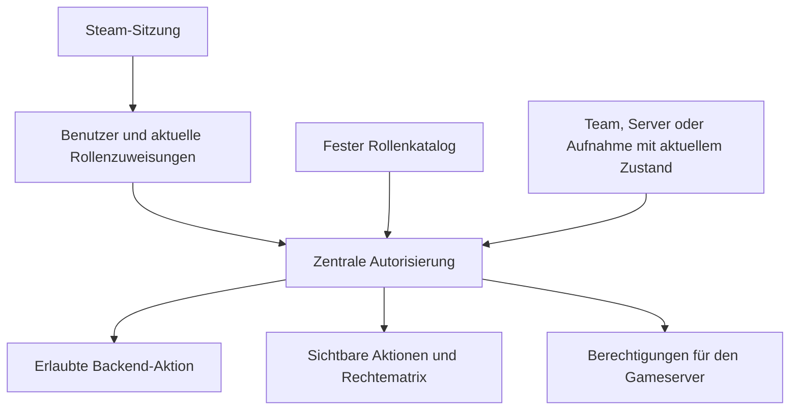

# Plan für zentrale Benutzerverwaltung und RBAC

Stand: 5. Oktober 2026. Dieser Entwurf ergänzt den [Plan für Team-Management und Strats](team-playbooks-plan.md). Die erste Umsetzung ist vorhanden; dieses Dokument hält Entscheidungen und technische Begründungen fest.

Vereinbart sind feste, zentral gepflegte Rollen und eine sichtbare Rechtematrix. Ein Benutzerkonto verwendet dieselbe Steam-Identität für Website, Server und Teams. Rollenzuweisungen haben einen Geltungsbereich. Alle Bereiche verwenden ein gemeinsames Autorisierungsmodul.

## Warum die bisherige Rolle nicht ausreicht

Vor der Umstellung besaß ein Benutzer genau ein Feld `role` mit `admin`, `match_admin`, `training_player` oder `player`. Die Rollen verbinden Website- und Serverrechte. Express prüft sie in einer globalen Allowlist, das Frontend vergleicht Rollennamen und das Server-Plugin liest dieselben vier Namen aus einer Runtime-Datei. Das sind konkrete Stellen für die Umstellung. [Benutzermodell](../admin-panel/src/store.ts), [Rollen und CSS-Flags](../admin-panel/src/policy.ts), [Express-Prüfungen](../admin-panel/src/app.ts), [Frontend-Prüfungen](../admin-panel/client/src/main.tsx), [Plugin-Prüfungen](../nades-plugin/MatchZyNades/AccessControl.cs).

Zusätzlich gelten bereits Regeln pro Aufnahme. Ein Ersteller darf nur seine noch nicht offiziellen Wurfdaten bearbeiten; Kartenpositionen und das Zurücknehmen einer Freigabe folgen anderen Regeln. Ein zentrales RBAC muss diese Regeln erhalten. [Lineup-Rechte](../admin-panel/shared/lineup-policy.ts), [Projektregeln](../AGENTS.md).

## Ein Benutzer mit Rollen in mehreren Bereichen

Ein Rollenname beschreibt eine Aufgabe in der Verwaltung. Die Zuweisung ergänzt, wo die Rolle gilt. Beispielsweise ist Sebastian Trainingsspieler auf dem bestehenden Server, Owner in Team A und Mitglied in Team B. Owner in Team A erlaubt keine Änderungen an Team B oder am Gameserver.

| Geltungsbereich | Rolle | Geplante Befugnisse |
| --- | --- | --- |
| Plattform | Benutzer | Nades lesen, eigene Favoriten und zulässige eigene Aufnahmen verwalten, nach Steam-Anmeldung Teams gründen und Einladungen annehmen |
| Plattform | Plattform-Admin | Benutzer sowie Plattform- und Serverrollen verwalten; bestehende administrative Nade-Funktionen ausführen |
| Ein Server | Trainingsspieler | Trainingspanel und freigegebene Trainingswerkzeuge im erlaubten Spielmodus verwenden |
| Ein Server | Match Admin | Bisherige Match-, Practice-, Map- und eingeschränkte Serververwaltung einschließlich der bestehenden RCON-Berechtigung |
| Ein Server | Server-Admin | Vollständige Verwaltung dieses Servers einschließlich Einstellungen, Neustart, Diagnose und Konsole |
| Ein Team | Mitglied | Veröffentlichte Strats, eigene Aufgaben, Teamübersicht und Live-Ansicht lesen; selbst austreten |
| Ein Team | Captain | Zusätzlich Strats erstellen, bearbeiten, veröffentlichen, archivieren, besetzen und aktivieren |
| Ein Team | Owner | Zusätzlich Team, Mitglieder, Einladungen und Teamrollen verwalten sowie Eigentum übertragen |

Die Basismöglichkeiten eines angemeldeten Benutzers gelten auch für Plattform-Admins. Höhere Serverrollen enthalten die vorgesehenen Trainingsmöglichkeiten. Dafür verwendet der feste Rollenkatalog ausdrücklich zusammengestellte Rechte, keine pauschale Regel „Admin darf alles“.

Die Rolle Server-Admin trennt die technische Serververwaltung von Plattformverwaltung und Nade-Freigaben. Ein Plattform-Admin erhält Serverzugriff über eine zusätzliche Serverzuweisung. Bei der Umstellung erhalten bisherige Admins beide Rollen, sodass ihre bisherigen Möglichkeiten erhalten bleiben.

Ein aktives Team hat genau einen Owner. Pro Team und Benutzer gibt es eine Verwaltungsrolle. Für Plattform und einzelnen Server genügt ebenfalls jeweils eine Rolle. Ein Benutzer kann insgesamt beliebig vielen unterschiedlichen Teams zugeordnet sein. Der bestehende einzelne Gameserver erhält bereits einen stabilen internen Geltungsbereich; eine Verwaltung mehrerer Gameserver gehört nicht zu dieser Erweiterung.

Entry, Support, Lurker und AWP sind taktische Aufgaben. Sie stehen an den Plätzen einer Strat und erscheinen nicht im RBAC-Rollenkatalog.

## Rechte vergeben und erklären

Die Rolle bestimmt zulässige Aktionen, etwa `strats.edit`, `strats.activate`, `teams.invite` oder `server.rcon`. Geltungsbereich und betroffene Daten ergänzen die Entscheidung. Die Entscheidung für eine konkrete Strat benötigt ihre tatsächliche Team-ID aus der Datenbank.

| Aktion | Wer darf sie ausführen? |
| --- | --- |
| Neues Team gründen | Angemeldeter Steam-Benutzer; er wird Owner dieses neuen Teams |
| Mitglieder einladen oder entfernen | Ausschließlich der aktuelle Owner dieses Teams |
| Mitglied zum Captain machen oder zurückstufen | Ausschließlich der aktuelle Owner dieses Teams |
| Eigentum übertragen | Aktueller Owner, an ein bestehendes Mitglied seines Teams |
| Plattform- oder Serverrollen vergeben | Plattform-Admin; Teamrollen berechtigen dazu nicht |
| Strats erstellen, bearbeiten, veröffentlichen und aktivieren | Owner oder Captain des betroffenen Teams |
| Private Strats lesen | Mitglied des betroffenen Teams, entsprechend dem Veröffentlichungsstatus |
| Offiziell oder Must Know vergeben | Plattform-Admin nach den bestehenden Nade-Regeln |

Auch die zentrale Benutzerverwaltung darf die Owner-Regel nicht umgehen. Ein Plattform-Admin sieht dort die Rollenzuordnungen eines Benutzers, kann dessen fremde Teamzuweisungen aber nicht verändern. Teaminterne Strats werden dadurch nicht lesbar. Ist er selbst Owner dieses Teams, gelten seine Owner-Rechte. Ein Supportzugriff mit zusätzlichen Befugnissen ist nicht vorgesehen.

Server-Admins dürfen den Server bedienen, aber keine Plattform- oder Serverrollen vergeben. Diese Aufgabe bleibt in der zentralen Plattformverwaltung. Captains dürfen die Besetzung einer Strat ändern; das verleiht dem besetzten Spieler weder Captain-Rechte noch Serverzugriff.

Einladungslinks verleihen ausschließlich eine Mitgliedschaft. Der Owner kann daraus später einen Captain machen. Der Server prüft Ablauf, Widerruf und die aktuelle Owner-Zuordnung der Einladung. Nach einer Owner-Übertragung werden noch offene Einladungen des bisherigen Owners ungültig. Ein erneuter Beitritt erzeugt keine doppelte Mitgliedschaft.

Die eigene Plattform-Admin-Rolle kann wie bisher nur ein anderer Plattform-Admin ändern. Mindestens ein Plattform-Admin bleibt erhalten. Eine Owner-Übertragung ändert in einem Vorgang den bisherigen Owner zum Mitglied und das ausgewählte Mitglied zum Owner. Anschließend kann der neue Owner dem bisherigen Owner die Captain-Rolle geben.

## Zentrale Benutzerverwaltung in der Oberfläche

`Verwaltung → Benutzer` ersetzt die heutige Einordnung unter Server. Ein Benutzerprofil zeigt Steam-ID und Namen sowie getrennte Abschnitte für Plattformrolle, Serverrollen und Teammitgliedschaften. Es handelt sich um dieselbe Person, unabhängig davon, von welcher Seite ihr Profil geöffnet wird.

`Verwaltung → Rollen und Rechte` zeigt den festen Rollenkatalog als lesbare Matrix. Die Oberfläche erlaubt Rollenzuweisungen, aber keine frei konfigurierbaren Rollen oder einzelnen Sonderrechte. Ein Änderungsverlauf hält Akteur, betroffenen Benutzer, Geltungsbereich sowie vorherige und neue Rolle fest.

`Team-Management` verwendet dieselben Identitäten, Rollendefinitionen und Vergabeprüfungen, zeigt dem Owner aber nur sein Team. Es gibt dort keine zweite globale Benutzerliste und keine gesonderten Berechtigungsschalter. Captains und Mitglieder können den Teamkader lesen; nur der Owner erhält die Verwaltungselemente. Steam-ID und andere teamfremde Zuordnungen werden nur angezeigt, soweit die jeweilige Ansicht sie benötigt.

Die Anzeige einer konkreten Berechtigung soll ihren Grund erklären können, beispielsweise „Strat bearbeiten erlaubt durch Captain in Team A“ oder „Nicht erlaubt: Du bist Mitglied in Team B“. Die Erklärung darf keine Informationen über fremde Teams offenlegen.

## Gemeinsame Entscheidung für Website und Server

Das Autorisierungsmodul stellt ein kleines Interface bereit, sinngemäß `authorize(actor, action, resource)`. Es ermittelt die aktuellen Rollenzuweisungen, prüft deren Geltungsbereich und berücksichtigt die Regeln der betroffenen Daten. Aufrufer müssen keine Kombinationen aus Rollennamen selbst zusammenstellen.

Jede geschützte Anfrage prüft die Aktion und ihre konkreten Daten serverseitig. Unbekannte Aktionen oder Rollen erlauben keinen Zugriff. Die Website erhält daraus abgeleitete erlaubte Aktionen für Navigation und Buttons; diese Angaben sind keine Autorisierung für spätere Schreibzugriffe. Diese Ausrichtung folgt den Empfehlungen zu serverseitigen Prüfungen je Anfrage und zur Berücksichtigung von Objektbeziehungen. [OWASP Authorization Cheat Sheet](https://cheatsheetseries.owasp.org/cheatsheets/Authorization_Cheat_Sheet.html).

Ein Beispiel: `strats.edit` ist für einen Captain nur auf Strats seines Teams erlaubt. `lineups.edit` ist für einen angemeldeten Ersteller nur bei seiner noch nicht offiziellen Aufnahme erlaubt. `lineups.position` ist für den Ersteller oder einen Plattform-Admin auch nach Freigabe erlaubt. Das sind RBAC-Rechte mit ergänzenden Regeln über Eigentum und Zustand. Eine neue Rolle für jede mögliche Kombination aus Team, Ersteller und Review-Status wird nicht benötigt. Rollen mit zusätzlichen Attributen sind auch im NIST-Material als kombinierbarer Ansatz beschrieben. [NIST RBAC](https://csrc.nist.gov/projects/role-based-access-control).

Neue API-Abfragen begrenzen bereits die Datenbankabfrage auf zugängliche Teams. Das gilt für Listen, direkte URLs und die Live-Ansicht. Schreibende Aktionen prüfen außerdem die aktuelle Revision. Ein Teamfilter oder eine vom Browser eingereichte `teamId` ist kein Nachweis einer Berechtigung.

Alle bestehenden Eingänge müssen in diese Umstellung einbezogen werden: Express-Routen, Upload- und Review-Aktionen, Datenströme sowie Ingame-Befehle. Fachliche Prüfungen wie Spielmodus, lebender Spieler oder eine zulässige Nade-Freigabe bleiben zusätzlich erhalten. Bereits offene Datenströme dürfen nach Entzug der jeweiligen Berechtigung keine weiteren geschützten Daten liefern.

## Speicherung ohne doppelte Rollenquellen

Empfohlen ist folgendes Modell für die vorhandene MongoDB:

| Daten | Verbindlicher Speicherort |
| --- | --- |
| Identität, Name, Favoriten | Bestehende `users`-Collection mit Steam-ID als stabiler Identität |
| Rollendefinitionen und Aktionskatalog | Ein versionierter, typisierter Katalog im Code |
| Plattform- und Serverzuweisungen | `roleAssignments/current` mit Benutzerzuweisungen für Plattform und Server sowie gemeinsamer Revision |
| Teammitgliedschaften und Teamrollen | `members` im jeweiligen Team-Dokument, pro Mitglied genau eine Rolle |
| Verbindliche Teamrolle | Ausschließlich dieser Eintrag im Team, keine zusätzliche Kopie in `users` oder `roleAssignments` |
| Änderungen an Rechten | Bestehender Audit-Speicher mit strukturierten Angaben zur Änderung |

Das zentrale Autorisierungsmodul liest Plattform- und Serverzuweisungen sowie Teammitgliedschaften als ein einheitliches Modell von Rollenzuweisungen. Die unterschiedlichen Speicherorte begründen keine unterschiedlichen Berechtigungssysteme.

Die kleine CS-Team-Mitgliederliste im Team-Dokument erlaubt eine atomare Owner-Übertragung. Eine Änderung schreibt die validierte nächste Liste nur dann, wenn die gelesene Revision noch aktuell ist. Es bleibt genau ein Owner und jeder Benutzer kommt höchstens einmal vor. Parallel eingereichte Rollenänderungen oder Austritte müssen bei einem Konflikt erneut geprüft werden. MongoDB unterstützt solche atomaren Dokumentänderungen mit erwarteten Werten im Updatefilter. [MongoDB Atomicity and Transactions](https://www.mongodb.com/docs/manual/core/write-operations-atomicity/).

Die erste Implementierung speichert Plattform- und Serverzuweisungen in einem gemeinsamen Dokument mit einer nach Steam-ID indizierten Benutzerstruktur. Ein Revisionsvergleich schützt jede Änderung und die Mindestanzahl der Plattform-Admins atomar. Diese Wahl vermeidet Transaktionen auf der bestehenden MongoDB-Einzelinstanz. Bei einer erheblich größeren Benutzerbasis muss das Dokument wegen der MongoDB-Größenbegrenzung auf mehrere Datensätze mit Transaktionen umgestellt werden. Teamrollen bleiben ausschließlich im jeweiligen Team-Dokument.

## Anbindung an den Gameserver

Vor der Umstellung exportierte [runtime-files.ts](../admin-panel/src/runtime-files.ts) Rollennamen und CSS-Flags. Das Plugin interpretierte diese Namen selbst. Die zentrale RBAC-Umstellung ersetzt diese zweite Rolleninterpretation durch aus dem Katalog abgeleitete Berechtigungen für den konkreten Server.

Der Export enthält Steam-ID, Server-ID, Schema-Version, Revision und die benötigten effektiven Rechte. CSS-Flags bleiben ein Adapter für CounterStrikeSharp und MatchZy. Ihre Zuordnung kommt aus demselben Katalog. Teams, Strat-Aufgaben und Plattformverwaltung werden nicht an das Plugin exportiert.

Für administrative Nade-Aktionen im Spiel fließen die einschlägigen Plattformrechte gezielt in die Serverberechtigungen ein. Ein bloßer Server-Admin erhält dadurch keine Nade-Freigaberechte. Das Plugin prüft zusätzlich Trainingszugang und Spielzustand. Ingame-Prüfungen von Ersteller und Aufnahmestatus müssen dieselben Regeln wie die Website einhalten.

Ein Export wird als konsistenter Stand veröffentlicht. Das Plugin darf Rollen und CSS-Flags nicht aus unterschiedlichen Revisionen kombinieren. Rechteänderungen werden im Web bei folgenden Anfragen wirksam; für das Plugin zeigt die Verwaltung den veröffentlichten und bestätigten Stand. Entzug von Trainingsrechten beendet weiter die betreffenden Werkzeuge und Panels. Bei ungültigen oder nicht unterstützten Berechtigungsdaten werden keine privilegierten Funktionen freigegeben.

Der bestehende Match Admin besitzt uneingeschränktes RCON. Ein Konsolenbefehl kann deshalb administrative Änderungen am Gameserver durchführen, auch wenn entsprechende Website-Buttons fehlen. `server.rcon` wird als weitreichendes Recht sichtbar ausgewiesen. Die Umstellung erhält es zunächst bei den bestehenden Match Admins. RBAC verspricht für diesen Zugang keine Beschränkung auf einzelne Spielbefehle. [Bisheriges RCON-Verhalten](../README.md#server-konsole), [serverseitige Rollenprüfung](../nades-plugin/MatchZyNades/AccessControl.cs).

Diese Anpassung betrifft die bestehende Berechtigungsinfrastruktur. Die neuen Strats bleiben vollständig im Web. Das kompakte HUD mit neun Listenplätzen und der Nade-Sync erhalten keine neue Teamfunktion.

## Bestehende Benutzer dieses Projekts umstellen

Die Umstellung verwendet ausschließlich die aktuellen Benutzer. Es gibt keinen Import aus `cs-playbook`.

| Bisherige Rolle | Neue Zuweisungen |
| --- | --- |
| `player` | Plattform-Benutzer, keine privilegierte Serverrolle |
| `training_player` | Plattform-Benutzer und Trainingsspieler auf dem bestehenden Server |
| `match_admin` | Plattform-Benutzer und Match Admin auf dem bestehenden Server |
| `admin` | Plattform-Admin und Server-Admin auf dem bestehenden Server |

Steam-IDs, Favoriten, Eigentum an Nades und bestehende Freigaben bleiben erhalten. Die Migration ist versioniert und wiederholbar, ohne spätere Rollenzuweisungen zu überschreiben. Neue Steam-Logins erhalten weiterhin nur die Basismöglichkeiten. Der Bootstrap-Admin wird beim ersten Anlegen auf das neue Modell abgebildet. Der besondere Testzugang bleibt eingeschränkt und darf nicht durch gespeicherte Rollen aufgewertet werden.

Die Einführung erfolgt in prüfbaren Schritten:

1. Die wirksamen heutigen Rechte aus Code und Tests als Matrix erfassen. Dazu gehören Erstellerregeln, Testzugang, RCON und erlaubte Match-Admin-Einstellungen.
2. Das Autorisierungsmodul einführen. Ein befristeter Adapter bildet die vier alten Rollen auf den neuen Katalog ab; die bestehenden Funktionen behalten ihr Verhalten. Neue Prüfungen im Backend und erlaubte UI-Aktionen verwenden bereits dieses Modul.
3. Den versionierten Berechtigungsexport und das passende Plugin gemeinsam einführen und prüfen. Neue getrennte Rollen dürfen erst vergeben werden, wenn das Plugin sie korrekt auswerten kann. Ein Server-Admin darf nicht über den alten Namen `admin` versehentlich zum Plattform-Admin werden.
4. Die Zuweisungen migrieren und die zentrale Benutzerverwaltung aktivieren. Nach dem Übergang ist `users.role` keine zweite beschreibbare Rechtequelle mehr. Rückfall auf alte Rollen erfolgt nicht stillschweigend.
5. Team-Management und Strats auf derselben Autorisierung aufbauen.

## Abnahme des Berechtigungsmodells

- Owner in Team A und Mitglied in Team B darf ausschließlich Team A verwalten. Captain in Team B erlaubt dort Strats, aber keine Mitgliederverwaltung.
- Ein Plattform-Admin ohne Mitgliedschaft kann keine fremden Strats lesen und keine Teamrollen ändern. Ein Server-Admin erhält keine Nade-Freigaberechte oder Benutzerverwaltung.
- Jede bestehende Nade-Regel bleibt erfüllt, einschließlich Positionierung offizieller Aufnahmen, Rücknahme einer Freigabe, Erstellerrechten und persönlichen Favoriten.
- Direkte API-Anfragen, manipulierte Team-IDs und versteckte Buttons ergeben dieselben Berechtigungsentscheidungen.
- Gleichzeitige Owner-Übertragungen, Austritte und Rollenänderungen erzeugen weder doppelte Owner noch ein aktives Team ohne Owner.
- Rechteentzug wirkt auf folgenden Anfragen, in laufenden Live-Ansichten und nach bestätigter Übernahme im Plugin. Alte Exporte dürfen eine neuere Herabstufung nicht zurücksetzen.
- Tests vergleichen die aus dem Katalog erzeugten Serverrechte mit der Auswertung im Plugin. Unbekannte Berechtigungen und Formatversionen geben keine zusätzlichen Rechte.
- Die Migration erhält die wirksamen Rechte aller vier bisherigen Rollen und ändert keine bestehenden Nade-Daten.

Die Rechtematrix ist eine Grundlage für Tests. Zusätzlich prüfen Integrationstests echte Benutzer, Geltungsbereiche und Datensätze über authentifizierte Routen. Die Umsetzung prüft diese Grenzen zusätzlich mit authentifizierten API-Tests gegen MongoDB und Plugin-Tests.
